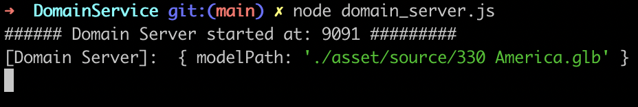

# grpc-learn > end 2 end demo

Contains the demo for grpc unary communication between frontend and grpc backend via [grpc-web](https://github.com/grpc/grpc-web) and [envoy](https://envoy.com/). Demo also contains inter server unary communication. Demo uses node server and javascript/HTML/CSS as front end. All the gRPC stub generated is in javascript.

The application diaplays a 3D model for the objects in the browser.

### App flow: 
* Each model will be present in a path and have a filename.
* When the user click respective object tile a gRPC request is sent to Domain Server.
* Domain Server will find the path and make gRPC request to Model Server, which returns the filename.
* Domain server will create the full path of the 3D model and sends the response back to UI.
* UI will then load the 3D model

### Architecture
1. Backend architecture

2. End to end architecture

### Executing the demo

#### Model Server
*  Navigate to service folder and install dependencies `npm i`
* ` node model_server.js `

#### Domain Server
*  Navigate to service folder and install dependencies `npm i`
* ` node domain_server.js `
* This will make a test gRPC request to Model and if everything is installed properly we should see below output.

    

#### Start envoy proxy
* Navigate to UIService > envoyProxy and execute `envoy -c envoy.yaml`.

#### Start UI service
* Navigate to UIService folder > app and install dependencies `npm i`
* [Install protoc](https://github.com/grpc/grpc-web#code-generator-plugin). You can install it via brew as well. It will take some tries to make protoc work, the version worked for me is `libprotoc 3.20.3`.
* Start webpack dev server `npm start`
    * Protoc compiler will generate `domain_grpc_web_pb.js` and `domain_pb.js` files in _app_ folder. These files are the stub generated based on the [domain.proto](./Protos/domain.proto) file. It contains service and method definitions to handle gRPC request/response.
    * Webpack will also combine all the javascript codebase and create a main.js and host it at http://localhost:8082/webpack-dev-server
* Access the application at http://localhost:8082

